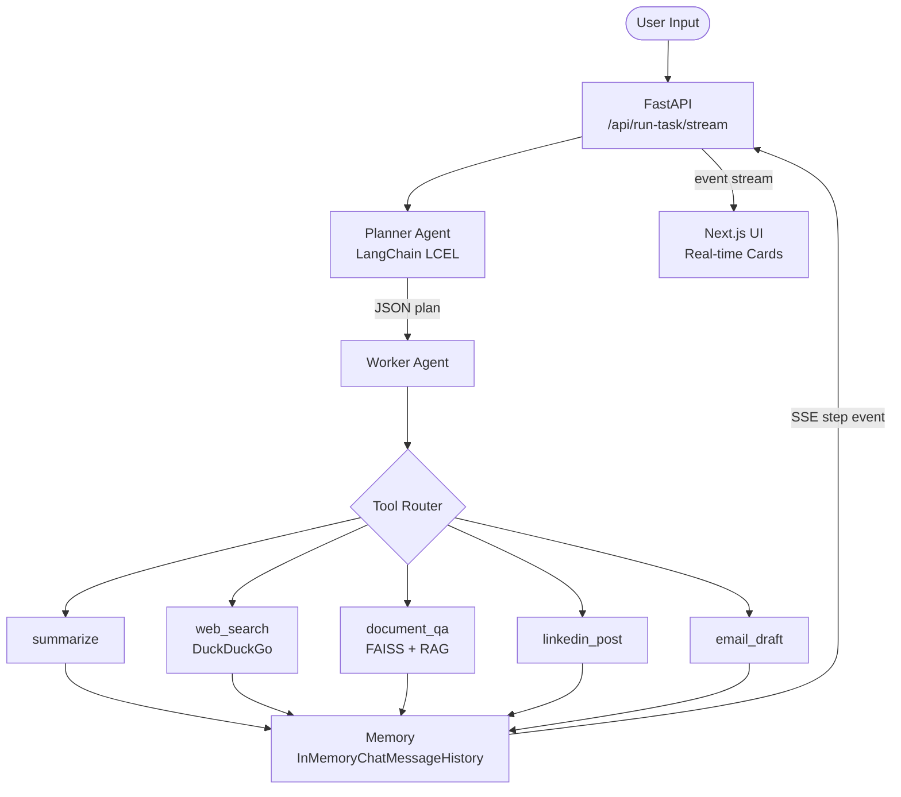

# Multi-Agent AI Task Automation System

> Production-grade multi-agent AI system with LangChain orchestration, FastAPI streaming backend, and Next.js real-time frontend


---

## Architecture

The system is composed of four cooperating components:

| Component | Description |
|-----------|-------------|
| **Planner Agent** | LangChain LCEL chain (`PromptTemplate \| ChatOpenAI \| StrOutputParser`) that decomposes a free-text task into a structured JSON execution plan with ordered steps, tool assignments, and dependencies. |
| **Worker Agent** | Iterates over the plan and dispatches each step to the correct tool. Retries failed steps up to 3 times and writes outputs into shared memory. |
| **FastAPI Backend** | Exposes a batch endpoint (`POST /api/run-task`) and a real-time Server-Sent Events endpoint (`GET /api/run-task/stream`) that yields each step result as it completes. |
| **Next.js Frontend** | App Router single-page application that opens an `EventSource` connection to the SSE endpoint and renders step cards one by one as they stream in. |

---

## Flow Diagram



---

## Features

- **LangChain LCEL orchestration** — Planner and all text tools are built as composable LCEL chains (`prompt | llm | parser`), with lazy LLM initialization so the app starts without a key.
- **Real-time SSE streaming** — Each agent step result is pushed to the browser the moment it completes via Server-Sent Events; no polling needed.
- **5 AI tools** — `summarize`, `linkedin_post`, `email_draft`, `web_search` (DuckDuckGo), and `document_qa` (FAISS vector retrieval).
- **Next.js App Router frontend** — Fully typed TypeScript client with color-coded tool badges, step metadata, and live status indicators.
- **Docker deployment** — Single `docker compose up --build` command spins up both services with correct inter-container networking.
- **ConversationBufferMemory** — Step outputs are recorded in a LangChain `InMemoryChatMessageHistory` buffer so later steps can reference earlier results.

---

## Setup

### Option 1 — Docker (recommended)

**Prerequisites:** Docker and Docker Compose installed.

```bash
# Clone the repo
git clone <repo-url>
cd multi-agent-ai

# Set your OpenAI key and launch
OPENAI_API_KEY=sk-... docker compose up --build
```

| Service | URL |
|---------|-----|
| Next.js frontend | http://localhost:3000 |
| FastAPI backend | http://localhost:8000 |
| API docs (Swagger) | http://localhost:8000/docs |

---

### Option 2 — Local Development

**Prerequisites:** Python 3.11+, Node.js 20+

#### 1. Backend

```bash
# Install Python dependencies
pip install -r requirements.txt

# Set your OpenAI key
export OPENAI_API_KEY=sk-...

# Start the FastAPI server
uvicorn api.main:app --host localhost --port 8000 --reload
```

#### 2. Frontend

```bash
cd frontend

# Install Node dependencies
npm install

# Start the Next.js dev server (runs on port 3000)
npm run dev
```

Open **http://localhost:3000** in your browser.

---

## API Reference

### `POST /api/run-task`

Run a task and receive the full result in a single JSON response.

**Request**
```json
{
  "task": "Search for the latest AI news, summarize it, and draft a LinkedIn post"
}
```

**Response**
```json
{
  "task": "Search for the latest AI news, summarize it, and draft a LinkedIn post",
  "plan": {
    "steps": [
      { "id": "step1", "description": "Search for latest AI news", "tool": "web_search", "dependencies": [] },
      { "id": "step2", "description": "Summarize the search results", "tool": "summarize", "dependencies": ["step1"] },
      { "id": "step3", "description": "Write a LinkedIn post from the summary", "tool": "linkedin_post", "dependencies": ["step2"] }
    ]
  },
  "trace": [
    {
      "id": "step1",
      "tool": "web_search",
      "status": "success",
      "result": "OpenAI announced...",
      "attempt": 1,
      "elapsed_seconds": 1.24,
      "confidence": 0.9
    }
  ],
  "final_output": {
    "step1": { "id": "step1", "tool": "web_search", "status": "success", "result": "..." },
    "step2": { "id": "step2", "tool": "summarize", "status": "success", "result": "..." },
    "step3": { "id": "step3", "tool": "linkedin_post", "status": "success", "result": "..." }
  }
}
```

---

### `GET /api/run-task/stream?task=...`

Stream step results in real time using Server-Sent Events.

**Query parameter:** `task` (string, required)

**Event stream format:**

```
event: plan
data: {"steps": [{"id": "step1", "tool": "web_search", ...}, ...]}

event: step
data: {"id": "step1", "tool": "web_search", "status": "success", "result": "...", "attempt": 1, "elapsed_seconds": 1.24, "confidence": 0.9}

event: step
data: {"id": "step2", "tool": "summarize", "status": "success", "result": "...", "attempt": 1, "elapsed_seconds": 2.01, "confidence": 0.9}

event: done
data: {"step1": {...}, "step2": {...}, "step3": {...}}
```

**JavaScript client example:**

```javascript
const es = new EventSource(`/api/run-task/stream?task=${encodeURIComponent(task)}`)

es.addEventListener('plan', (e) => console.log('Plan:', JSON.parse(e.data)))
es.addEventListener('step', (e) => console.log('Step:', JSON.parse(e.data)))
es.addEventListener('done', ()  => es.close())
```

---

## Project Structure

```
.
├── agents/
│   ├── planner.py          # LangChain LCEL planner chain
│   └── worker.py           # Step executor with retry logic
├── api/
│   └── main.py             # FastAPI app (batch + SSE endpoints)
├── core/
│   ├── executor.py         # Orchestrates run() and run_stream()
│   ├── memory.py           # InMemoryChatMessageHistory wrapper
│   └── logger.py           # Rotating file logger
├── tools/
│   ├── text_tools.py       # summarize, linkedin_post, email_draft
│   ├── search_tool.py      # DuckDuckGo web search
│   └── document_tool.py    # FAISS + OpenAI RAG chain
├── frontend/
│   ├── app/
│   │   ├── page.tsx        # SSE streaming UI
│   │   └── layout.tsx      # Root layout
│   ├── next.config.js      # API proxy → localhost:8000
│   └── Dockerfile
├── Dockerfile              # Backend container
├── docker-compose.yml      # Orchestrates both services
└── requirements.txt
```

---

## Environment Variables

| Variable | Required | Description |
|----------|----------|-------------|
| `OPENAI_API_KEY` | Yes | OpenAI API key for LLM calls and embeddings |
| `BACKEND_URL` | Docker only | Backend URL seen by the frontend container (default: `http://backend:8000`) |
